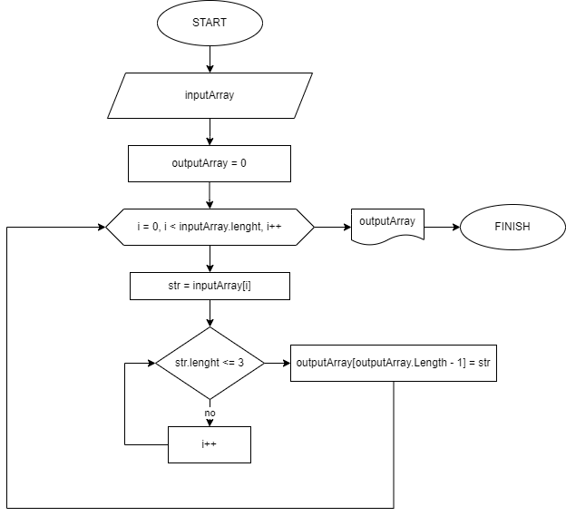

# **Условие задачи**
Написать программу, которая из имеющегося массива строк формирует новый массив из строк, длина которых меньше, либо равна 3 символам. Первоначальный массив можно ввести с клавиатуры, либо задать на старте выполнения алгоритма. При решении не рекомендуется пользоваться коллекциями, лучше обойтись исключительно массивами.

# **Блок-схема задачи**

# **Решение задачи**
1. Объявляем массив inputArray и инициализируем его строковыми значениями введенными пользователем

2. Создаем пустой массив outputArray типа string[].

3. Запускается цикл for, который проходит по индексам от 0 до inputArray.Length - 1.

4. На каждой итерации цикла:
> Получаем текущую строку str из inputArray по индексу i.\
Проверяем длину строки str с помощью str.Length.

* Если длина строки str меньше или равна 3 символам, то:

> Используем Array.Resize для увеличения размера массива outputArray на 1.\
Добавляем str в последний элемент массива outputArray.\
Иначе, если длина строки str больше 3 символов, ничего не делаем и переходим к следующей итерации цикла.

5. После завершения цикла, в outputArray будут содержаться только те строки из inputArray, длина которых меньше или равна 3 символам.

6. Затем, происходит вывод содержимого outputArray на экран с помощью цикла for.

7. Программа завершается.

